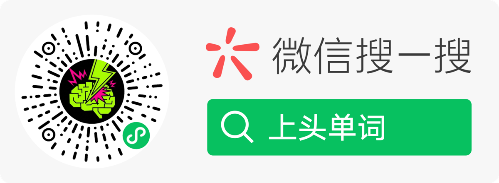

# 📚 LiveWords

<p align="center">
  
</p>

<p align="center">
  <strong>The more words you learn, the wilder the story gets.</strong><br>
  <em>Turn this week's vocabulary list into your very own 7-episode English mini-drama.</em>
</p>

<p align="center">
  <strong>背得越多，编得越疯。</strong><br>
  <em>用一部 7 集英文连续剧，把这周的单词，"上头"地学会。</em>
</p>

<p align="center">
  🌐 <a href="#english">English</a> · <a href="#中文">中文</a>
</p>

---

<a id="english"></a>

## 🇬🇧 English

<p align="center">
  <a href="#-try-livewords">Try it</a> ·
  <a href="#-what-is-this">What is this</a> ·
  <a href="#-how-it-works">How it works</a> ·
  <a href="#-engineering-highlights">Engineering</a> ·
  <a href="#-docs">Docs</a>
</p>

### 🎬 Try LiveWords

**Scan with WeChat to launch the mini program:**

<p align="center">
  
</p>

---

### ✨ What is this?

**LiveWords (上头单词) is a WeChat mini program built for Chinese learners of English.**

The pitch is simple: it is *not* another flashcard app. Instead, it turns your weekly vocabulary list into **a 7-episode English mini-drama, generated live by an LLM, with a protagonist, suspense, and branching choices.**

> 🎭 You are not learning isolated words — you are watching your own English TV show.
>
> 📺 Episode 1 ends on a cliffhanger. Episode 2 picks up where you left off. You want to know what happens next, so you naturally come back and learn the next batch of words.
>
> 🎲 Episode 4 has a **mid-week branching choice** — the story forks, and your choice is **permanent**.

#### Why does this matter?

- Traditional vocab apps: *"I can't keep this up anymore."*
- LiveWords: *"What happens in the next episode? Let me just learn one more set."*

The trick is binding **dopamine reward** (the curiosity of watching a show) to **learning behavior** (memorizing words).

---

### 🎮 How it works

```
┌─────────────────────────────────────────────────────────────┐
│                                                             │
│   Pick wordpack (CEFR A2 / B1 / B2 / C1 / C2) + vibe        │
│                          ↓                                  │
│            Episode 1: words[1] + vibe → AI generates        │
│                       (ends on cliffhanger)                 │
│                          ↓                                  │
│            Episode 2: continues from E1 + words[2]          │
│                       (another cliffhanger)                 │
│                          ↓                                  │
│                       …Episode 3…                           │
│                          ↓                                  │
│            Episode 4: 🎲 mid-week branching choice          │
│                       (once chosen, locked forever)         │
│                          ↓                                  │
│                  …Episodes 5 & 6…                           │
│                          ↓                                  │
│            Episode 7: 🎬 finale                             │
│                       (climactic resolution + epilogue)     │
│                                                             │
└─────────────────────────────────────────────────────────────┘
```

#### 🔑 Experience contracts

| Experience | How we deliver it |
|---|---|
| **Every target word appears naturally in the story** | LLM-enforced coverage + auto-repair on miss |
| **Chinese-English mixed prose** | Target words stay English; everything else translates to Chinese |
| **Continuity across episodes** | Full prior context + Episode N-1 state digest fed into the prompt |
| **You are the protagonist** | Protagonist Mode injects `users.nickName` into the lead role |
| **Stale stories can be revived** | Retain-and-mark expiry + bounded revival |
| **Your branch choice is irreversible** | `BRANCH_IMMUTABLE` error code + optimistic locking |

---

### 🛠️ Engineering highlights

LiveWords is not a demo-grade "AI wrapper." We treat the LLM as **production infrastructure** and built the engineering scaffolding to match.

#### 1️⃣ Eval-driven prompt engineering

No "let me tweak it a few times and ship" — we run a real evaluation pipeline:

- 📐 **Rubric v2** — multi-dimensional scoring
- 🔁 **Multi-round param-sweep** — comparing models and parameters (hunyuan-2.0 vs DeepSeek, temperature curves)
- 📊 **Every generation persists `promptMeta`** — `flowOk`, `missingEpisodes`, `mismatchReasons`, `systemPromptSha1` — full causal traceability
- 🛠️ **Built-in eval workbench** — visual chain comparison in the frontend

→ Deep dive: [docs/eval-methodology.md](docs/eval-methodology.md)

#### 2️⃣ Production-grade stability for an LLM product

**This is the hardest part.** LLMs fail in production, hallucinate, and break under concurrent load. LiveWords protects user experience via these contracts:

| Contract | Problem it solves |
|---|---|
| **`operationId` idempotent writes** | Network retries causing the same episode to be generated twice → same operationId reuses the prior result |
| **`expectedRev` optimistic locking** | Concurrent submissions corrupting state → stale revisions return `REV_CONFLICT` |
| **Failure repair pipeline** | Missing target words / illegal Mixed tokens / wrong word count → auto-repair once before marking failed |
| **Lease-based retry queue** | Failed drafts aren't lost — a scheduler retries them with a lease |
| **Retain-and-mark expiry** | We don't delete your story when it expires; you can revive it once (bounded) |

→ Deep dive: [docs/architecture.md](docs/architecture.md)

#### 3️⃣ Strict Chinese-English mixed token validation

Mixed paragraphs (`paragraph.mixed`) must satisfy:
- ✅ Target words must stay in English (even when embedded in Chinese phrases)
- ❌ No other English content words allowed
- ✅ Only a tiny allowlist of function words permitted
- ✅ English tokens must have whitespace on both sides

This is **enforced server-side by a validator** — failure triggers repair.

→ Deep dive: [docs/story-engine.md](docs/story-engine.md)

#### 4️⃣ Design: bright, light, premium

- 🎨 Teal primary (`#23C4C9`) + generous whitespace — anti-"cyberpunk learning app" aesthetic
- ⚡ Core learning path is 1-2 taps away
- 🌫️ Zero dark mode, zero dense ornamentation, zero dopamine-bait UI

→ Deep dive: [docs/design.md](docs/design.md)

---

### 🏗️ Architecture overview

```
┌─────────────────────────────────────────────────────────────┐
│                                                             │
│   WeChat Mini Program (miniprogram/)                        │
│   ┌─────────────────────────────────────────────────────┐   │
│   │  welcome → index (home) → masteredWords             │   │
│   │       ↓                  → storyArchive             │   │
│   │  WeChat OneTap Login     → settings                 │   │
│   │       ↓                                             │   │
│   │  story-reader (component)                           │   │
│   │       ↑                                             │   │
│   │  Local cache (story / mastered stats / seen words)  │   │
│   └─────────────────────────────────────────────────────┘   │
│                            ↓ wx.cloud.callFunction          │
│   ┌─────────────────────────────────────────────────────┐   │
│   │  Cloud Functions (cloudfunctions/)                  │   │
│   │                                                     │   │
│   │  • userData   — profile, word state, settings       │   │
│   │  • storyData  — story cycle, episode generation     │   │
│   │  • fetchStory — read-only story helper              │   │
│   └─────────────────────────────────────────────────────┘   │
│                            ↓                                │
│   ┌─────────────────────────────────────────────────────┐   │
│   │  Tencent CloudBase NoSQL                            │   │
│   │                                                     │   │
│   │  users · user_words · dictionary                    │   │
│   │  story_episode_drafts · story_draft_retry_queue     │   │
│   │  story_user_ops · story_archive · gen_logs          │   │
│   └─────────────────────────────────────────────────────┘   │
│                            ↓                                │
│   ┌─────────────────────────────────────────────────────┐   │
│   │  LLM Providers                                      │   │
│   │  • Tencent Hunyuan (default)                        │   │
│   │  • DeepSeek                                         │   │
│   └─────────────────────────────────────────────────────┘   │
│                                                             │
└─────────────────────────────────────────────────────────────┘
```

---

### 📁 Repository layout

```
livewords/
├── miniprogram/         # WeChat mini program (frontend)
│   ├── pages/           # welcome / index / masteredWords /
│   │                    # storyArchive / settings / ...
│   ├── components/      # story-reader · ui-button · ui-card
│   └── utils/           # cloudCall · syncQueue · highlight · hyphenator ...
├── cloudfunctions/
│   ├── userData/        # user profile & word state ✅ full source
│   ├── fetchStory/      # read helpers ✅ full source
│   └── storyData/       # story engine 🔒 redacted stub (see file header)
├── docs/
│   ├── architecture.md         # ⭐ runtime contracts (source of truth for this README)
│   ├── story-engine.md         # ⭐ how the 7-episode engine actually works
│   ├── eval-methodology.md     # ⭐ how prompt quality is measured & tuned
│   ├── design.md               # UI/UX spec (color, typography, motion)
│   ├── CURRENT_ARCHITECTURE.md # detailed contract spec
│   ├── design/                 # UI design references
│   ├── guides/                 # testing / rollout / content quality guides
│   └── product/                # backlog (delivered + icebox)
├── scripts/
│   ├── quality/         # lint · verify · docs-consistency validator
│   └── smoke/           # smoke tests for userData / storyData
└── package.json
```

---

### 🔒 About the redactions

> This is the **public showcase build** of LiveWords.

| Status | Content |
|---|---|
| ✅ **Fully public** | Mini program frontend, `userData` / `fetchStory` cloud functions, design & architecture docs, engineering scripts |
| 🔒 **Redacted to stub** | `cloudfunctions/storyData/index.js` prompt-build implementation (replaced with contract description) |
| ❌ **Not published** | `PROMPTS.md` (prompt templates), `scripts/story-eval/` (evaluation pipeline), internal plans/specs |

**Why this split?**

LiveWords is at the commercialization stage; its core moat is **prompt engineering and evaluation methodology**. Showing engineering capability and architectural thinking without handing over the recipe is the intent of this repository.

For deeper collaboration or code evaluation, please reach out.

---

### 📖 Docs

| Order | Document | What it covers |
|---|---|---|
| 1️⃣ | [docs/architecture.md](docs/architecture.md) | **Start here**: system overview, runtime contracts, data model |
| 2️⃣ | [docs/story-engine.md](docs/story-engine.md) | Story engine design: 7-episode structure, generation pipeline, repair flow |
| 3️⃣ | [docs/eval-methodology.md](docs/eval-methodology.md) | Eval-driven tuning: rubric, param-sweep, observability |
| 4️⃣ | [docs/design.md](docs/design.md) | UI/UX design system |
| 5️⃣ | [docs/CURRENT_ARCHITECTURE.md](docs/CURRENT_ARCHITECTURE.md) | Detailed contract spec (source of truth) |
| 6️⃣ | [docs/guides/CONTENT_QUALITY.md](docs/guides/CONTENT_QUALITY.md) | Content quality contracts |
| 7️⃣ | [docs/guides/ROLLOUT_PLAYBOOK.md](docs/guides/ROLLOUT_PLAYBOOK.md) | Rollout playbook |

---

### 🧪 Engineering verification

The repository retains the full quality gate scripts:

```bash
npm run lint                  # ESLint
npm run verify                # Baseline lint + tests
npm run verify:docs           # Documentation consistency
npm run verify:rollout        # Rollout playbook checks
npm run verify:regression     # Regression suite
npm run smoke:userData        # userData cloud function self-test
npm run smoke:storyData       # storyData cloud function self-test
npm run smoke:remote          # Remote smoke test (requires CloudBase credentials)
```

---

### 📮 Contact

- Maintainer: [@NOime22](https://github.com/NOime22)
- For business or code-review inquiries, open a GitHub Issue or reach out via my profile

---

### 📄 License

This repository's code and documentation are licensed under [**Creative Commons Attribution-NonCommercial 4.0 (CC-BY-NC-4.0)**](LICENSE):

- ✅ You may view, study, and cite
- ✅ You may build on it for learning purposes
- ❌ **No commercial use of any kind**

For a commercial license, please contact the author.

---
---

<a id="中文"></a>

## 🇨🇳 中文

<p align="center">
  <a href="#-体验-livewords">体验</a> ·
  <a href="#-这是什么">是什么</a> ·
  <a href="#-怎么玩">怎么玩</a> ·
  <a href="#-技术亮点">技术亮点</a> ·
  <a href="#-文档导览">文档</a>
</p>

### 🎬 体验 LiveWords

**微信扫码体验小程序：**

<p align="center">
  
</p>

---

### ✨ 这是什么

**LiveWords（中文名"上头单词"）是一款专为中国英语学习者设计的微信小程序。**

它的核心不是"另一个单词卡片应用"——而是把每周的词表，**变成一部由 LLM 现场生成、有悬念、有主角、有分支选择的 7 集英文连续剧**。

> 🎭 你学的不是孤立单词，而是一部专属于你的英文剧。
>
> 📺 第 1 集学完留个悬念，第 2 集回来接上——你想知道接下来发生什么，于是顺手就学完了下一批单词。
>
> 🎲 第 4 集还有一次「中段选择」，剧情就此分叉，且**选择不可反悔**。

#### 为什么这个值得做？

- 传统单词 APP：「我又坚持不下去了」
- LiveWords：「下集到底咋样？我再背一组词就知道了」

把**多巴胺奖励**（追剧的好奇心）和**学习行为**（背单词）绑在一起。

---

### 🎮 怎么玩

```
┌─────────────────────────────────────────────────────────────┐
│                                                             │
│   选词包（CEFR A2 / B1 / B2 / C1 / C2）+ 主题氛围（vibe）       │
│                          ↓                                  │
│             第 1 集：words[1] + vibe → AI 现场生成              │
│                       （cliffhanger 收尾）                    │
│                          ↓                                  │
│             第 2 集：续写前情 + words[2]                        │
│                       （继续 cliffhanger）                    │
│                          ↓                                  │
│                  ……第 3 集……                                 │
│                          ↓                                  │
│             第 4 集：🎲 中段选择（branch choice）               │
│                       一旦选了，永远锁定                        │
│                          ↓                                  │
│                  ……第 5 / 6 集……                            │
│                          ↓                                  │
│             第 7 集：🎬 大结局（finale）                       │
│                       高潮对决 + 结局落地 + 余波                 │
│                                                             │
└─────────────────────────────────────────────────────────────┘
```

#### 🔑 体验核心

| 体验 | 怎么做到的 |
|---|---|
| **每集单词全部"自然"出现在剧里** | LLM 强制 target word 覆盖 + 失败自动 repair |
| **中英混排版** | 目标词强制保留为英文 token，其余强制翻译为中文 |
| **剧情连续不出戏** | 完整前情上下文 + Episode N-1 状态摘要传入 prompt |
| **主角是你自己** | Protagonist Mode：用 `users.nickName` 注入主角 |
| **故事过期可救回** | Retain-and-mark 设计 + bounded revival |
| **第 N 集选了就不能改** | `BRANCH_IMMUTABLE` 错误码 + 乐观锁 |

---

### 🛠️ 技术亮点

LiveWords 不是 demo 级的"AI 套壳"——它是把 LLM 当作生产环境基础设施在用，并为此构建了一整套工程化基础设施。

#### 1️⃣ Eval-Driven Prompt 工程

不靠"调几次试试"——而是有完整的评估流水线：

- 📐 **Rubric v2 评估标准**（多维度评分）
- 🔁 **多轮 param-sweep** 对比不同模型/参数表现（hunyuan-2.0 vs deepseek vs 不同 temperature）
- 📊 **每集生成都落库 `promptMeta`**：`flowOk`、`missingEpisodes`、`mismatchReasons`、`systemPromptSha1`，可追溯每次生成的因果
- 🛠️ **内置 eval workbench**（前端可视化）用于对比 chains

→ 想深入：[docs/eval-methodology.md](docs/eval-methodology.md)

#### 2️⃣ LLM 内容产品的"产线级稳定性"

**这才是最难的部分**——LLM 在生产环境会失败、会乱输出、会被并发请求踩坏。LiveWords 用以下契约保证了体验稳定：

| 契约 | 解决的问题 |
|---|---|
| **`operationId` 幂等写入** | 网络重试导致同一集被生成两次 → 同一 operationId 复用结果 |
| **`expectedRev` 乐观锁** | 双端并发提交导致状态错乱 → 旧版本提交返回 `REV_CONFLICT` |
| **失败 repair 链路** | LLM 漏词/Mixed 含非法英文/字数不达标 → 自动修复一次后再判失败 |
| **Lease-based retry queue** | 失败的草稿不丢，由定时器在后台 lease 模式重试 |
| **Retain-and-mark 过期** | 用户的故事不删除只标记 → 还能"复活"一次（bounded） |

→ 想深入：[docs/architecture.md](docs/architecture.md)

#### 3️⃣ 中英混排的强 Token 校验

混排段落（`paragraph.mixed`）必须：
- ✅ 目标词必须保留英文（哪怕嵌在中文专有名词里）
- ❌ 不能出现其他英文实词
- ✅ 仅允许极少量功能词（白名单）
- ✅ 英文 token 前后必须有空格

这一切都在后端 validator 里**强制执行**——失败就 repair。

→ 想深入：[docs/story-engine.md](docs/story-engine.md)

#### 4️⃣ 设计：明亮 · 轻盈 · 高级

- 🎨 Teal 主色（`#23C4C9`）+ 大量留白，反"赛博朋克学习应用"路线
- ⚡ 1-2 tap 进入学习核心路径
- 🌫️ 0 dark mode、0 dense ornament、0 dopamine bait UI

→ 想深入：[docs/design.md](docs/design.md)

---

### 🏗️ 架构概览

参见上方 [English Architecture overview](#️-architecture-overview) ↑

---

### 🔒 关于代码的脱敏说明

> 这是 **LiveWords 的公开展示版本**。

| 状态 | 内容 |
|---|---|
| ✅ **完整公开** | 小程序前端、`userData` / `fetchStory` 云函数、设计与架构文档、工程化脚本 |
| 🔒 **脱敏保留** | `cloudfunctions/storyData/index.js` 的 prompt 构建实现（替换为契约说明 stub） |
| ❌ **不公开** | `PROMPTS.md`（prompt 模板）、`scripts/story-eval/`（评估流水线）、内部 plans/specs |

**为什么这样设计？**

LiveWords 处于商业化阶段，其核心壁垒是 **prompt 工程与评估方法论**。公开展示其工程能力与架构思路，同时保留商业敏感资产，是一种"既能讲清做了什么，又不把菜谱送人"的平衡。

如需深度合作或代码评估，欢迎联系。

---

### 📖 文档导览

| 推荐阅读顺序 | 文档 | 内容 |
|---|---|---|
| 1️⃣ | [docs/architecture.md](docs/architecture.md) | **从这里开始**：系统全貌、运行时契约、数据模型 |
| 2️⃣ | [docs/story-engine.md](docs/story-engine.md) | 故事引擎设计：7 集结构、生成管线、修复链路 |
| 3️⃣ | [docs/eval-methodology.md](docs/eval-methodology.md) | 评估驱动调优：rubric、param-sweep、可观测性 |
| 4️⃣ | [docs/design.md](docs/design.md) | UI/UX 设计系统 |
| 5️⃣ | [docs/CURRENT_ARCHITECTURE.md](docs/CURRENT_ARCHITECTURE.md) | 详细契约规范（source of truth） |
| 6️⃣ | [docs/guides/CONTENT_QUALITY.md](docs/guides/CONTENT_QUALITY.md) | 内容质量契约 |
| 7️⃣ | [docs/guides/ROLLOUT_PLAYBOOK.md](docs/guides/ROLLOUT_PLAYBOOK.md) | 灰度发布手册 |

---

### 🧪 工程化验证

仓库保留了完整的质量门禁脚本：

```bash
npm run lint                  # ESLint
npm run verify                # 基线 lint + tests
npm run verify:docs           # 文档一致性校验
npm run verify:rollout        # 灰度发布手册校验
npm run verify:regression     # 回归验证套件
npm run smoke:userData        # userData 云函数 self-test
npm run smoke:storyData       # storyData 云函数 self-test
npm run smoke:remote          # 远程烟雾测试（需配置 CloudBase 密钥）
```

---

### 📮 联系

- 项目主理：[@NOime22](https://github.com/NOime22)
- 商务合作 / 代码评估请走 GitHub Issues 或主页联系方式

---

### 📄 License

本仓库代码与文档使用 [**Creative Commons Attribution-NonCommercial 4.0 (CC-BY-NC-4.0)**](LICENSE) 协议：

- ✅ 可以查看、学习、引用
- ✅ 可以基于学习目的二次创作
- ❌ **禁止任何形式的商业使用**

商业授权请联系作者。

---

<p align="center">
  <sub>📚 LiveWords · 上头单词 · Made with 💡 by <a href="https://github.com/NOime22">@NOime22</a></sub>
</p>
